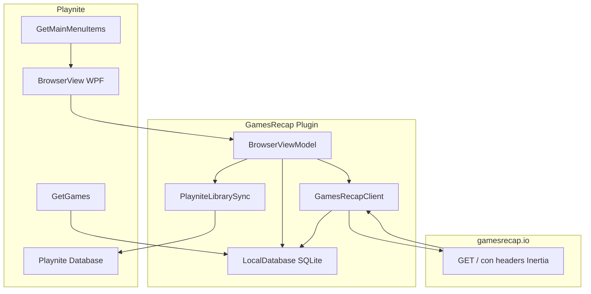

# Plan de implementación: GamesRecap Plugin para Playnite

## Contexto

El repositorio actual solo contiene documentación de diseño ([gamesrecap-playnite-plugin.md](gamesrecap-playnite-plugin.md)) y una respuesta real de la API ([respuesta-filtros-ex.json](respuesta-filtros-ex.json)). **No hay código C# todavía** — es un proyecto greenfield.

La consulta de ejemplo `?q=Control%20Resonant&platforms=1&showcases=300` devuelve 1 card (Control Resonant, PC Gaming Show #300) con paginación Laravel (`per_page: 60`, `total: 1`) y versión Inertia `91c5bce49007757d62740bf9f1aacac6`.

## Referencias Playnite

Seguir las guías oficiales:

- [Plugins Introduction](https://api.playnite.link/docs/tutorials/extensions/plugins.html): .NET Framework 4.6.2, solo referenciar `Playnite.SDK`, generar proyecto con Toolbox, cargar desde *Settings → For developers → External extensions*
- [Library Plugins](https://api.playnite.link/docs/tutorials/extensions/libraryPlugins.html): heredar `LibraryPlugin`, implementar `GetGames(LibraryGetGamesArgs)` devolviendo `GameMetadata`
- [Plugin settings](https://api.playnite.link/docs/tutorials/extensions/pluginSettings.html): `GetSettings` + `GetSettingsView`
- [Creating custom windows](https://api.playnite.link/docs/tutorials/extensions/windows.html): `PlayniteApi.Dialogs.CreateWindow()` para el browser WPF con tema Playnite
- SDK no es thread-safe: operaciones UI vía `PlayniteApi.MainView.UIDispatcher`

## Decisiones de arquitectura

| Decisión | Elección | Motivo |
|---|---|---|
| Tipo de plugin | **Library Plugin** | Añade fuente `Games Recap`, expone juegos promovidos vía `GetGames()`, metadata opcional |
| Vista browser | **Menú principal** (`GetMainMenuItems`) + ventana modal | Library plugins no tienen vista de descubrimiento nativa; patrón documentado en TestPlugin |
| Estado usuario | **SQLite local** en `GetPluginUserDataPath()` | Wishlist/vistos/ocultos propios; incluido en backups Playnite |
| Catálogo | **API Inertia** `GET https://gamesrecap.io/` | Un solo endpoint; filtros como query params |
| Caché | SQLite + TTL configurable | Evitar rate limiting y acelerar filtros repetidos |

## Flujo de datos



## Ajustes al diseño según JSON real

El archivo [respuesta-filtros-ex.json](respuesta-filtros-ex.json) confirma la spec pero añade campos que los DTOs deben contemplar:

- **`filters.hidden_ids`** y **`filters.view`** (`"cards"`) — no están en la tabla de la doc; incluirlos en `ActiveFilters`
- **`options.showcases`**: lista histórica enorme (~200+ entradas) con `series_key`, `series_label`, `event_name`, `start_at` — agrupar en UI por `series_key` + año
- **`options.sorts`**: array `{ value, label }` — poblar combo de ordenación dinámicamente
- Campos extra en cards: `custom_order`, `created_at`, `updated_at`; `tags` a nivel card (distinto de `game.tags`)
- Género real: `"Role-Playing (RPG)"` (id 23), no abreviado como en la doc

## Estructura del proyecto

Generar con Toolbox:

```bash
Toolbox.exe new LibraryPlugin "Games Recap" "c:\Users\rafae\PycharmProjects\games-recap-playnite\GamesRecapPlugin"
```

Estructura objetivo (según [gamesrecap-playnite-plugin.md](gamesrecap-playnite-plugin.md)):

```
GamesRecapPlugin/
├── extension.yaml
├── GamesRecapPlugin.cs          # LibraryPlugin principal
├── Services/
│   ├── GamesRecapClient.cs
│   ├── InertiaVersionCache.cs
│   ├── LocalDatabase.cs
│   └── PlayniteLibrarySync.cs
├── Models/                      # DTOs Inertia + entidades locales
├── ViewModels/
├── Views/
├── Settings/
└── Data/schema.sql
```

**Dependencias NuGet** (verificar versiones compatibles con Playnite antes de añadir):
- `System.Data.SQLite` — persistencia local
- Usar serialización del SDK (`SerializationPropertyName`) donde sea posible en lugar de Newtonsoft con versión distinta

## Fases de implementación

### Fase 0 — Scaffolding Playnite (1-2 días)

1. Generar proyecto Library Plugin con Toolbox
2. Configurar `.csproj`: Target `net462`, referencia solo `Playnite.SDK`
3. Crear `extension.yaml` con GUID fijo, nombre `Games Recap`, versión `0.1.0`
4. Implementar clase mínima:

```csharp
public class GamesRecapPlugin : LibraryPlugin
{
    public override LibraryPluginProperties Properties => new()
    {
        HasSettings = true,
        HasCustomizedGameImport = true
    };

    public override IEnumerable<GameMetadata> GetGames(LibraryGetGamesArgs args)
        => Enumerable.Empty<GameMetadata>(); // stub
}
```

5. Registrar carpeta `bin\Debug\` en *External extensions* y verificar carga en Playnite
6. Configurar debug: *Start external program* → ejecutable de Playnite ([doc plugins](https://api.playnite.link/docs/tutorials/extensions/plugins.html))

**Criterio de éxito:** plugin aparece en lista de extensiones sin errores.

---

### Fase 1 — SQLite y modelos (2-3 días)

1. Implementar [schema SQL completo](gamesrecap-playnite-plugin.md) en `LocalDatabase.cs`:
   - Creación idempotente al primer arranque
   - Tabla `AppMeta` para `inertia_version`
2. CRUD esencial:
   - `UserGameState`: wishlist / seen / hidden / `PlayniteId`
   - Upsert de taxonomía (`Platforms`, `Genres`, `Tags`, `Showcases`, `Companies`)
   - Upsert de `Games`, relaciones y `Cards`/`CardMedia` desde respuestas API
   - `GetWishlistedIds()`, `GetSeenIds()`, `GetHiddenIds()` para construir query params
   - `GetLibraryGames()` — solo registros con `PlayniteId != null`
3. Crear DTOs Inertia en `Models/` mapeando [respuesta-filtros-ex.json](respuesta-filtros-ex.json):
   - `InertiaResponse` → `component`, `props`, `version`, `url`
   - `HomeProps` → `cards`, `filters`, `options`, `upcomingShowcases`, `hiddenMatchingCount`
   - `PaginatedCards`, `Card`, `GrGame`, `Showcase`, `MediaItem`
   - Usar `[SerializationPropertyName("snake_case")]` del SDK
   - Propiedades nullable y listas vacías por defecto (tolerancia a cambios API)

**Criterio de éxito:** deserializar `respuesta-filtros-ex.json` en tests manuales y persistir 1 card completa en SQLite.

---

### Fase 2 — Cliente HTTP Inertia (2-3 días)

Implementar `GamesRecapClient.cs`:

**Headers obligatorios en cada petición:**
```http
X-Inertia: true
X-Inertia-Version: {cached}
Accept: application/json
```

**Query builder** — mapear filtros UI → URL (validado con ejemplo real):

| UI | Query param | Ejemplo real |
|---|---|---|
| Búsqueda | `q` | `Contro` |
| Plataformas incluir | `platforms` | `1` |
| Showcase | `showcases` | `300` |
| Wishlist local | `wishlisted_ids` + `wishlisted_mode` | desde SQLite |
| Vistos | `seen_ids` + `seen_mode` | desde SQLite |
| Ocultos | `hidden_ids` | desde SQLite |
| Fechas | `release_from`, `release_to` | ISO date |
| Orden | `sort` | `newest` (default) |
| Página | `page` | `1` |

**Lógica de versión (`InertiaVersionCache`):**
1. Leer versión de `AppMeta` o usar valor hardcoded inicial del JSON de ejemplo
2. Tras cada respuesta exitosa, persistir `response.version`
3. Si respuesta es 409 con header `X-Inertia-Location` → reintentar con nueva versión (manejo estándar Inertia)

**Resiliencia:**
- Timeout configurable (30s default)
- Backoff exponencial en 429/5xx
- No bloquear `GetGames()` — solo lectura SQLite

**Post-fetch:** `LocalDatabase.UpsertFromApiResponse(props)` sincroniza taxonomía + cards recibidas.

**Criterio de éxito:** desde consola/debug, fetch con filtros del ejemplo devuelve Control Resonant y persiste en DB.

---

### Fase 3 — Browser UI (4-5 días)

**Entrada:** `GetMainMenuItems` → item "Explorar Games Recap" abre `BrowserView` en ventana `CreateWindow` (1024×768, `CenterOwner`).

**Layout WPF** (`BrowserView.xaml`):
- Panel izquierdo: filtros
- Panel derecho: grid de cards + paginación + estados loading/error

**Filtros** (alimentados por `props.options` de última respuesta):
- TextBox búsqueda (debounce 400ms)
- Showcase: `TreeView`/`ComboBox` agrupado por `series_label ?? series_key`, sub-items por año (`start_at.Year`)
- Plataformas / Géneros / Tags: checkboxes incluir + toggle excluir
- Rango fechas (`DatePicker`)
- Ordenación: `ComboBox` desde `options.sorts`
- Estado: Todos | Solo wishlist | Excluir wishlist | Solo vistos | Ocultos

**Card template:**
- Cover IGDB (`cover_image_url`)
- Título + badge `kind` (DLC, update...)
- Fecha release (priorizar `release_windows` por plataforma filtrada)
- Showcase origen + `series_key`
- Plataformas (chips)
- Tags con color
- Botón trailer → `Process.Start` URL YouTube
- Botón wishlist (estrella) → abre diálogo

**Paginación:** botones Anterior/Siguiente + indicador `page X de Y` usando `cards.current_page`, `cards.last_page`, `cards.total`.

**MVVM:** `BrowserViewModel` con `RelayCommand`, propiedades observables, llamadas async al client en background thread, actualización UI en `UIDispatcher`.

**Indicador `hiddenMatchingCount`:** mostrar aviso si > 0 ("X juegos ocultos coinciden con el filtro").

**Criterio de éxito:** usuario puede filtrar, paginar, ver trailer y marcar wishlist sin errores UI.

---

### Fase 4 — Wishlist y sync con librería Playnite (3-4 días)

**Diálogo wishlist** (`WishlistDialog.xaml`):
- Opción A: solo guardar en SQLite (`UserGameState.Wishlisted = 1`)
- Opción B: añadir a librería Playnite con tags configurables (Wishlist, showcase, géneros)

**`PlayniteLibrarySync.cs`:**
```csharp
// Crear GameMetadata y añadir vía PlayniteApi.Database.Games.Add
new GameMetadata {
    GameId = $"gr-{gameId}",          // ID estable
    Name = title,
    Source = new MetadataNameProperty("Games Recap"),
    IsInstalled = false,
    Platforms = MapPlatforms(...),    // MetadataNameProperty
    Tags = selectedTags,
    CoverImage = new MetadataFile(coverUrl),
    Links = trailerLinks,
    ReleaseDate = releaseDate
}
```
- Guardar GUID Playnite en `UserGameState.PlayniteId`
- Si ya existe (`PlayniteId` no null): actualizar tags/metadata, no duplicar

**`GetGames()`** — implementación final ([doc diseño](gamesrecap-playnite-plugin.md)):
- Solo juegos con `PlayniteId != null`
- Lectura síncrona SQLite, sin HTTP
- Mapear plataformas desde `GamePlatforms` join

**Sincronización inversa:** al quitar juego de librería Playnite, limpiar `PlayniteId` en SQLite (opcional vía evento `Database.Games.ItemUpdated`).

**Criterio de éxito:** juego promovido aparece en Playnite con fuente "Games Recap", filtrable por tag Wishlist; `GetGames()` lo devuelve al reiniciar.

---

### Fase 5 — Metadata Provider (2-3 días)

Implementar `GamesRecapMetadataProvider : LibraryMetadataProvider`:

```csharp
public override LibraryMetadataProvider GetMetadataDownloader()
    => new GamesRecapMetadataProvider(this);
```

- `GetMetadata(Game)` enriquece desde SQLite local (cover, géneros, desarrolladores, trailer, IGDB id)
- Sin petición HTTP si datos en caché; fetch puntual solo si faltan datos
- Override `OnDemandMetadataProvider` si se necesita descarga bajo demanda

**Criterio de éxito:** "Descargar metadata" en Playnite completa campos desde datos GamesRecap.

---

### Fase 6 — Settings y pulido (2-3 días)

**`PluginSettings`** (`GetSettings` / `GetSettingsView`):
- TTL caché API (minutos)
- Comportamiento default del diálogo wishlist (solo wishlist vs añadir a librería)
- Timeout HTTP
- Botón "Limpiar caché local"

**UX:**
- Notificaciones `PlayniteApi.Notifications` en errores de red
- Respetar tema Playnite (evitar colores hardcoded; usar recursos dinámicos)
- Icono del plugin en `extension.yaml` / resources

**Criterio de éxito:** settings persisten entre sesiones; UI coherente con tema oscuro/claro de Playnite.

---

### Fase 7 — Empaquetado y documentación (1 día)

1. Build Release → empaquetar como `.pext` (zip con `extension.yaml` + DLLs)
2. README: requisitos (Playnite 10+, .NET 4.6.2), instalación, uso del browser, limitaciones API
3. Checklist manual de pruebas

## Mapeo Playnite ↔ GamesRecap

| Campo Playnite | Origen |
|---|---|
| `Name` | `game.title` |
| `GameId` | `gr-{game.id}` |
| `Source` | `"Games Recap"` |
| `Platforms` | `game.platforms[].name` |
| `Genres` | `game.genres[].name` |
| `Tags` | Wishlist + showcase + tags seleccionados |
| `CoverImage` | `game.cover_image_url` |
| `BackgroundImage` | `game.screenshot_url` |
| `ReleaseDate` | `release_windows` o `release_date` |
| `Links` | `media[].url` (trailers) |
| `IsInstalled` | `false` |

## Riesgos y mitigaciones

| Riesgo | Mitigación |
|---|---|
| Cambio `X-Inertia-Version` | Cachear en SQLite; detectar 409; reintentar automático |
| JSON no documentado cambia | DTOs tolerantes; logging de deserialización fallida |
| Conflictos NuGet con Playnite | Solo SDK + verificar versiones de dependencias en [deps Playnite](https://api.playnite.link/docs/tutorials/extensions/plugins.html) |
| `GetGames()` lento | Solo SQLite; índices en `UserGameState.PlayniteId` |
| Rate limiting | TTL caché + debounce búsqueda + backoff |
| UI thread crashes | Todo binding/update vía `UIDispatcher` |
| `options.showcases` enorme | Cachear en SQLite; UI con virtualización y agrupación |

## Estimación

| Fase | Días |
|---|---|
| 0 Scaffolding | 1-2 |
| 1 SQLite + modelos | 2-3 |
| 2 Cliente Inertia | 2-3 |
| 3 Browser UI | 4-5 |
| 4 Wishlist + librería | 3-4 |
| 5 Metadata | 2-3 |
| 6 Settings + pulido | 2-3 |
| 7 Empaquetado | 1 |
| **Total** | **17-24 días** |

## MVP recomendado (entregable intermedio ~8-10 días)

Para validar valor antes del producto completo:

1. Fases 0-2 completas
2. Fase 3 reducida: grid + filtros básicos (búsqueda, plataforma, showcase, sort) sin excluir
3. Fase 4 reducida: wishlist SQLite + promover a librería sin diálogo de tags
4. Posponer: metadata provider, filtros exclude, estado seen/hidden, empaquetado

Esto permite explorar showcases y wishlistear desde Playnite con el menor riesgo.

## Archivos clave a crear primero

1. [GamesRecapPlugin/GamesRecapPlugin.cs](GamesRecapPlugin/GamesRecapPlugin.cs) — punto de entrada
2. [GamesRecapPlugin/Services/GamesRecapClient.cs](GamesRecapPlugin/Services/GamesRecapClient.cs) — integración API
3. [GamesRecapPlugin/Services/LocalDatabase.cs](GamesRecapPlugin/Services/LocalDatabase.cs) — persistencia
4. [GamesRecapPlugin/Models/InertiaModels.cs](GamesRecapPlugin/Models/InertiaModels.cs) — DTOs basados en [respuesta-filtros-ex.json](respuesta-filtros-ex.json)
5. [GamesRecapPlugin/Views/BrowserView.xaml](GamesRecapPlugin/Views/BrowserView.xaml) — UI principal
